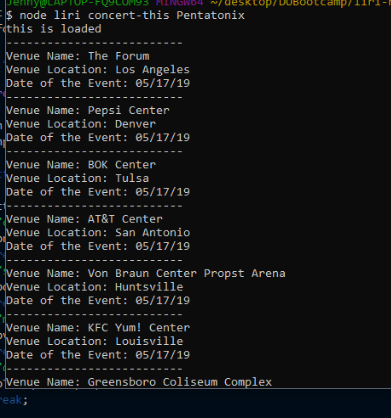
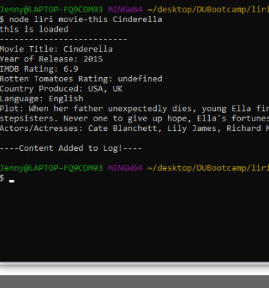
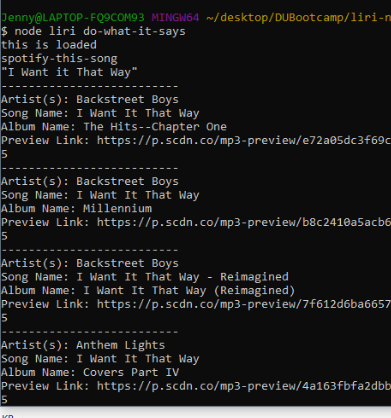
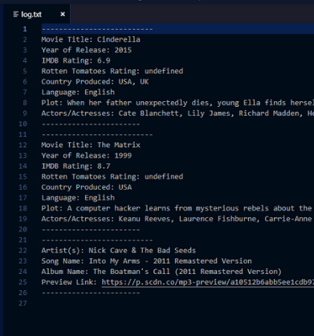

# It's Like Siri, but Liri!

###### About this app:

LIRI is like iPhone's SIRI. However, while SIRI is a Speech Interpretation and Recognition Interface, LIRI is a _Language_ Interpretation and Recognition Interface. LIRI will be a command line node app that takes in parameters and gives you back data.

Using four commands (listed below), along with parameters of their choosing, users can run certain functions that will call specific data. These commands include:

```concert-this```

```spotify-this-song```

```movie-this```

```do-what-it-says```

## Instructions

1. Open up your terminal (such as Git Bash).
2. Navigate to the directory that includes the liri.js file.
3. Run one of the following commands:

    ```node liri concert-this <concert of user's choice>```

    ```node liri spotify-this-song <song of user's choice>```

    ```node liri movie-this <movie of user's choice>```

    ```node liri do-what-it-says```

## The Output

Here's what users see after running each of the commands:

```node liri concert-this <concert of user's choice>```

After accessing the Bandsintown API, users will see a list of all events and locations where the artist or band they inputted will perform. It can result in multiple records. See the screenshot below:



 ```node liri spotify-this-song <song of user's choice>```

After accessing the Spotify API, users will be able to see data available for their selected song, including artist(s) name, track name, album name and a preview link if available. See the screenshot below:


```node liri movie-this <movie of user's choice>```

After accessing the OMDB API, users will be able to see data that's available for their selected movie, including movie title, year of release, IMDB rating, Rotten Tomatoes Rating, Country produced, language, plot and actors/actresses. See the screenshot below:



```node liri do-what-it-says```

This is a special command that will read instructions written in the file, random.txt. At present, the instructions say, "spotify-this-song,'I Want it That Way'". After running the command, the user will see the screenshot below:



## Bonus!

For every command, the returned data is being written to a log. Users can find their saved data within log.txt. See screenshot below:


